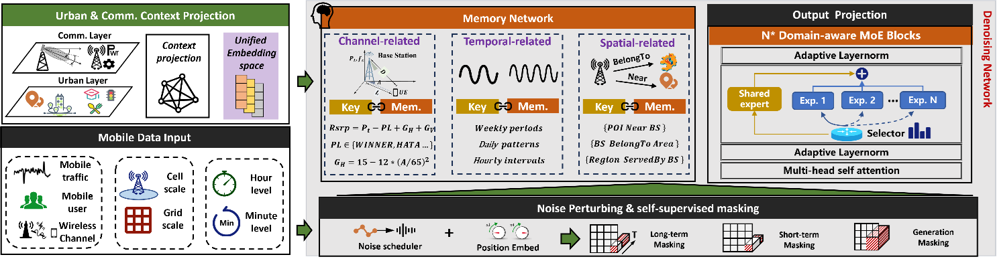

# MobiFM



1. **Code Description**  
   Provides training code for running the MobiFM **backbone** network.

2. **Sample Datasets**  
   The `datasets/` folder includes the 8 datasets mentioned in the paper, each containing 1000 samples:  
   - Traffic: `[1000, 168]`  
   - Users: `[1000, 168]`  
   - RSRP: `[1000, 96]`

3. **SKG Embedding**  
   Provides the corresponding SKG `kg_embedding` with shape `[1000, 1, 256]`.

4. **Pretrained Mapping Weights**  
   `MapModel1.pth` and `MapModel2.pth` are the pretrained weights of our **flow-based mapping** models, used to map base-station parameters to a high-dimensional embedding space.

5. **Backbone Model File**  
   `models_with_mask_scale_multiprompt_moe_memory.py` is the MobiFM **backbone** model.

6. **Requirements**  
   - Python >= 3.7  
   - PyTorch >= 2.0.0  
   - CUDA >= 11.7

7. **Run**  
   ```bash
   python main.py

8. **Result**
   - After training, the `experiments/` directory will contain the corresponding result data and the original ground-truth data.
